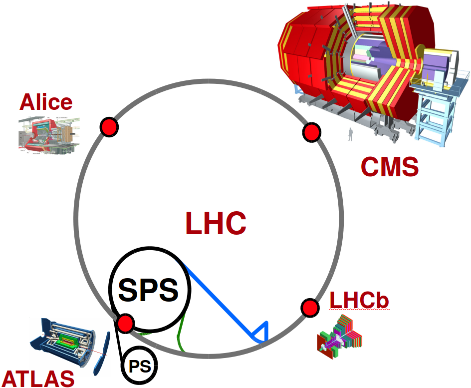
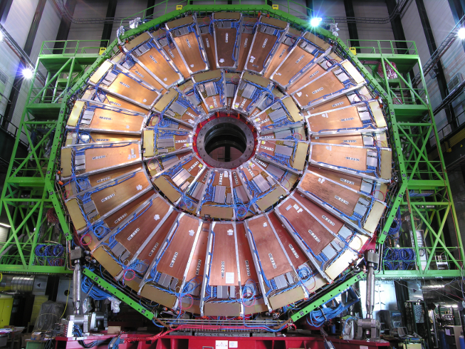
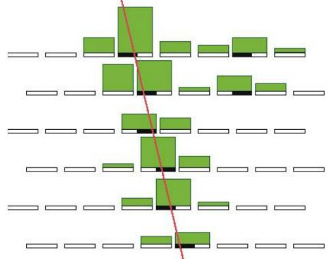

---
title       : "My projects"
subtitle    : 
author      : Khristian Kotov
job         : 
framework   : io2012        # {io2012, html5slides, shower, dzslides, ...}
highlighter : highlight.js  # {highlight.js, prettify, highlight}
hitheme     : tomorrow      # 
github:
  user: kkotov 
  repo: talks
url:
  lib:    ../../../../monohiggs/plots/libraries
  assets: ../../../../monohiggs/plots/assets
widgets     : [mathjax]     # {mathjax, quiz, bootstrap}
mode        : selfcontained # {standalone, draft}

--- .class #id

## Outline

Zooming in the big picture: from fundamental questions to the bolts and nuts in my projects

 

Custom-built hardware and software for data processing

 

 meets data analyses

My projects in
* EMTF
* L1T O2O
* Physics analyses/data processing
* DQM
* Machine Learning

Hobbies/Interests:
* text mining (tf-idf)
* forecasting (wavelets/furier)
* suffix trees

--- .class #id

## Zooming in the big picture

 

* Just enough of particle physics for bioinformatitians

* The Large Hadron Collider and particle detectors

* Compact Muon Solenoid detector

* Muon Endcap subsystem

* Electronics

* Track-Finding

---  &twocol

## Just enough of particle physics for bioinformatitians

Standard Model is a universal theory describing microscopic world with incredible precision

*** =left

*** =right

Quarks form protons and neutrons like triplets of the four bases form aminoacids 
(e.g. Glutamine = CAG; $p = uud$, $n = udd$)

But particles easily turn into each other (e.g. $n \rightarrow p^+ + e^- + \bar{\nu}_e$ when $d \rightarrow u + W^-$)

The focus of HEP is in accurately measuring such dynamics
and looking for any diviations from the model (i.e. new physics)

*** =fullwidth

There theory is complete, but there are still many open questions; some of those:

* [Dark matter observed in skies](https://indico.cern.ch/event/312657/contributions/1685474/attachments/598780/823985/kk_2014.09.26.pdf): what it is and where whould it fit in the table above?

* What happens beyond our energy reach where the model no longer describes nature?

--- &twocol

## The Large Hadron Collider ("wet lab" of HEP)

*** =left

*** =right

Collision energy $\sim 10^4$ proton masses

Collision frequency $\sim 40 MHz$ (every 25 ns)

Data rate $\sim 20 PB$ per year

*** =fullwidth

--- .class #id

## Compact Muon Solenoid (a high-speed 3D camera)

 

--- &twocol

## Muon Endcap System

*** =left

6,000 m$^2$ sensetive area

2,000,000 anode wires (200,000 channels)

250,000 strip (analog) channels

540 overapping chambers

*** =right

--- .class #id

## Electronics

