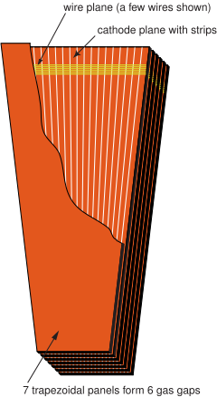

---
title       : "My projects"
subtitle    : 
author      : Khristian Kotov
job         : 
framework   : io2012        # {io2012, html5slides, shower, dzslides, ...}
highlighter : highlight.js  # {highlight.js, prettify, highlight}
hitheme     : tomorrow      # 
github:
  user: kkotov 
  repo: talks
url:
  lib:    ../../../../monohiggs/plots/libraries
  assets: ../../../../monohiggs/plots/assets
widgets     : [mathjax]     # {mathjax, quiz, bootstrap}
mode        : selfcontained # {standalone, draft}

--- .class #id

## Outline

A brief review of bolts and nuts of Hight Energy Physics

My projects in
* EMTF
* L1T O2O
* Physics analyses/data processing
* DQM
* Machine Learning

Other Hobbies/Interests:
* text mining (tf-idf)
* forecasting (wavelets/furier)

--- .class #id

## The Large Hadron Collider

--- .class #id

## Compact Muon Solenoid

--- &twocol

## Muon Endcap System

*** =left

*** =right

New&nbsp;L1TMuonEndCapForests[_Stage2v0_hlt] will be used with new EMTF emulator (in progress)

* History for these tags was reconstructed starting ~June 2016 (e.g. [last report](http://kkotov.github.io/l1o2o/talks/2017.03.20) for CaloParams)

* Validation (data-emulator comparison) was ran on a Heavy Ion run ([muons](https://its.cern.ch/jira/browse/CMSLITDPG-3), [calo](https://its.cern.ch/jira/browse/CMSLITDPG-4))

* Future Monte Carlo tags will be generated from these O2O tags and used in MC campaigns

*** =fullwidth

---  &twocol

## Cathode Strip Chambers

*** =left

* bla-bla-bla

*** =right

---  &twocol

## Time Constraints

*** =left

* bla-bla

*** =right

* bla-bla

--- .class #id

## Electronics

