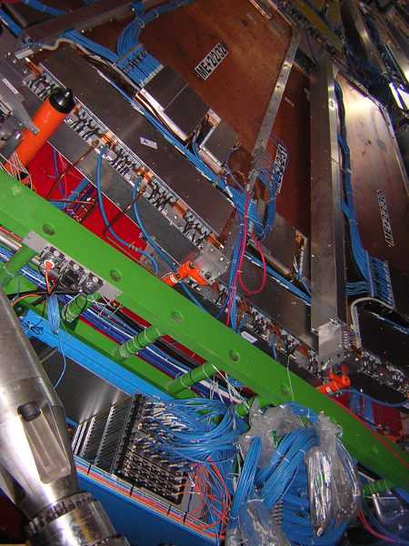
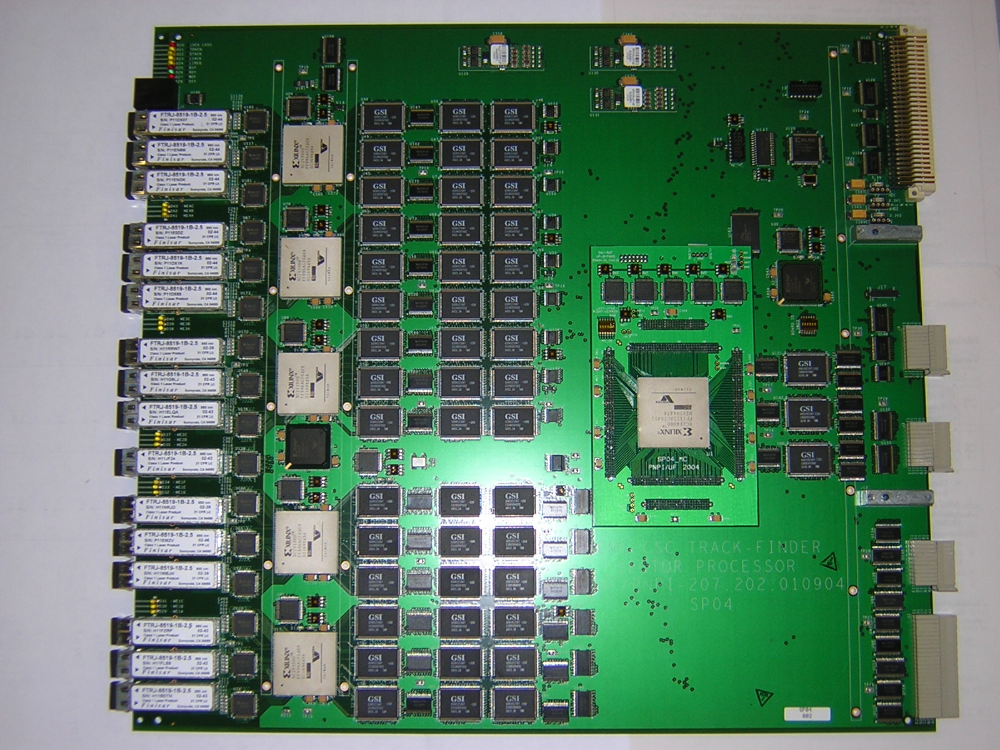
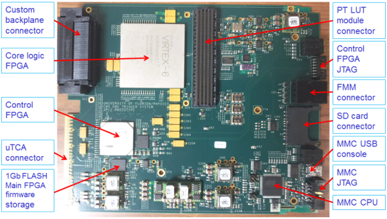
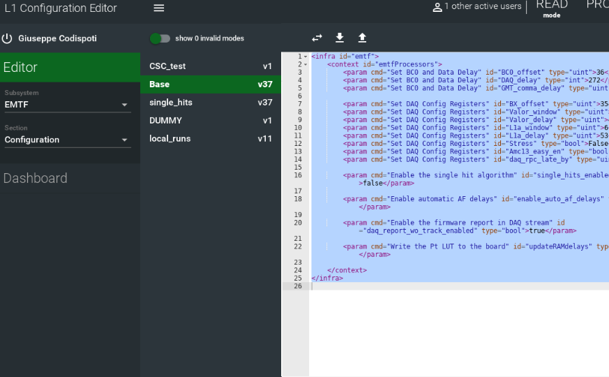
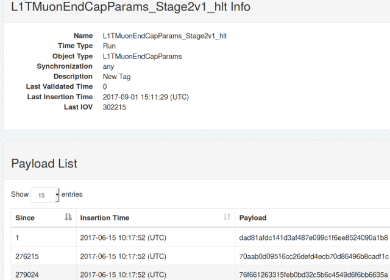

---
title       : "My projects"
subtitle    : 
author      : Khristian Kotov
job         : 
framework   : io2012        # {io2012, html5slides, shower, dzslides, ...}
highlighter : highlight.js  # {highlight.js, prettify, highlight}
hitheme     : tomorrow      # 
github:
  user: kkotov 
  repo: talks
url:
  lib:    ../../../../monohiggs/plots/libraries
  assets: ../../../../monohiggs/plots/assets
widgets     : [mathjax]     # {mathjax, quiz, bootstrap}
mode        : selfcontained # {standalone, draft}

--- .class #id

## Outline

 
 

# Zooming in the big picture: from fundamental questions to the bolts and nuts of my projects

 
 

# My projects in the domain

 
 

# Other interests

--- .class #id

 
 
 

# Zooming in the big picture:

 

* Just enough of particle physics

* The Large Hadron Collider and particle detectors

* Compact Muon Solenoid detector

* Muon Endcap subsystem

* Electronics

* Track-Finding

---  &twocol

## Just enough of particle physics

Standard Model is a universal theory describing microscopic world with incredible precision

*** =left

*** =right

Quarks form protons and neutrons like triplets of the four bases form amino acids 
(e.g. Glutamine = CAG; $p = uud$, $n = udd$)

But particles easily turn into each other (e.g. $n \rightarrow p^+ + e^- + \bar{\nu}_e$ when $d \rightarrow u + W^-$)

Focus on accurately measuring this dynamics
and look for deviations from predictions

*** =fullwidth

There theory is complete, but there are still many open questions; some of those:

* [Dark matter observed in skies](https://indico.cern.ch/event/312657/contributions/1685474/attachments/598780/823985/kk_2014.09.26.pdf): what it is and where would it fit in the table above?

* What happens beyond our energy reach where the model no longer describes nature?

--- &twocol

## The Large Hadron Collider

*** =left

*** =right

Collision energy $\sim 10^4$ proton masses

Collision frequency $\sim 40 MHz$ (every 25 ns)

Data rate $\sim 20 PB$ per year

--- .class #id

## Compact Muon Solenoid (a high-speed 3D camera)

 

--- &twocol

## Muon Endcap System

*** =left

6,000 m$^2$ sensitive area

2,000,000 anode wires (200,000 channels)

250,000 strip (analog) channels

540 overlapping chambers

*** =right

--- &twocol

## Custom-built electronics

*** =left

Readout:

*** =right

Track-finding:

([an upgraded version](http://iopscience.iop.org/article/10.1088/1748-0221/8/12/C12034/pdf) was deployed last year)

--- .class #id

## Track-finding problem

Link track segments into a trajectory and measure particle's momentum from its bending:

Time constraint: system completes the arithmetic within 6-10 external clock ticks

The logic is implemented in the main Xilinx FPGA using Vivado framework (i.e. firmware in C++)

--- .class #id

 
 
 
 

# My projects in HEP:

 

* Assigning particle momentum using Machine Learning

* Hardware-oriented projects

* Conditions' logging system (online DB to offline DB)

* Data analysis (at scale)

* Other projects

--- &twocol

## Machine Learning

Multiple scattering and non-uniform $B$-field make analytic momentum assignment impractical

Using simulated events I [train](https://github.com/kkotov/emtfPtRegression) a model predicting track's momentum from measured hits:

*** =left

*** =right

     type        |  measurement in station
-----------------|---------------------------
 $\theta$        |           2
 $\Delta\phi$    | 1-2, 1-3, 1-4, 2-3, 2-4, 3-4
 $\Delta\theta$  | 1-2, 1-3, 1-4, 2-3, 2-4, 3-4
 bend            |      1, 2, 3, 4

*** =fullwidth

Performance is studied for [random forests](https://github.com/imbs-hl/ranger) and [boosted trees](https://cran.r-project.org/web/packages/gbm/index.html) in R, and neural net in [H2O](http://h2o.ai)

Random Forests are [re-implemented](https://github.com/kkotov/ml/) for the existing track-finder simulation package in C++

Details (performance metrics, model selection, input compression) are given in
$[$[1](https://kkotov.github.io/emtfPtRegression/2017.01.19/handout.html),[2](https://kkotov.github.io/emtfPtRegression/2017.02.10/handout.html),[3](https://kkotov.github.io/emtfPtRegression/2017.03.03/handout.html),[4](https://kkotov.github.io/emtfPtRegression/2017.03.17/handout.html)$]$

--- &twocol

## Microcontrollers

Firmware for the Module Management Controllers (MMC) on the Track-Finding boards:

* [$\mu$TCA](https://en.wikipedia.org/wiki/Advanced_Telecommunications_Computing_Architecture) board
is managed (i.e. power sequences, monitoring, ports, ...) by a microcontroller

* protocols for communicating with crate controller are implemented in [CERN MMC](https://espace.cern.ch/ph-dep-ESE-BE-uTCAEvaluationProject/MMC_project/default.aspx) C library

* I've customized the firmware
$[$[1](https://svnweb.cern.ch/trac/cactus/browser/branches/madorsky_emtf/emtf_1704/mmc/mtf7_base_mmc_cern#user),[2](https://svnweb.cern.ch/trac/cactus/browser/branches/madorsky_emtf/emtf_1704/mmc/mtf7_optical_ppod_mmc_cern#user)$]$
for our boards; it runs in production fine for >1 year

*** =left

*** =right

--- &twocol

## Databases

Hardware emulators in [CMSSW](http://cms-sw.github.io/) rely on framework in fetching their configuration from CondDB

It is stored as boost-serialized C++ objects indexed by symbolic tag and sequential run number

In contrast, hardware configuration is XML stored in another DB and indexed by symbolic keys

For each run my automated system $[$[1](https://github.com/kkotov/l1o2o/blob/master/README.md),[2](http://kkotov.github.io/l1o2o/talks/2016.04.19),[3](https://github.com/cms-sw/cmssw/blob/master/L1TriggerConfig/Utilities/test/README.md)$]$
parses XMLs and constructs C++ objects in CondDB

*** =left

*** =right

--- .class #id

## Physics data analysis

* Clean data from noise (aka. select events) and reduce dimensionality (aka. ntuplize)
* Construct a model including nuisance parameters (aka. uncertainties)
* Fit model to the data and extract confidence intervals on the parameters of interest

The first part usually requires (repetitive) batch processing of hundreds of terabytes of data

Event-type data processing is easily parallelizable and done on grid and local [condor](https://research.cs.wisc.edu/htcondor/) clusters 

While event selection is easy, the bulk of analyzer's work goes into estimating uncertainties

--- .class #id

## Other HEP projects

[Control and monitoring](https://github.com/kkotov/emtf_cell/) system for the Track-Finding (worked with/after Atanas) providing:
* State machine (Halted/Configured/Running) orchestrated by [the central service](https://cds.cern.ch/record/2194548/files/CR2016_121.pdf)
* System health monitoring
* Expert-level web interface

Data Quality Monitoring (DQM) for Endcap Muon system commissioning (old):
* [Software](https://github.com/koskot77/cmssw) for reading and interpreting raw data format as produced by the electronics
* Prompt [feedback system](http://cms-csc.web.cern.ch/cms-csc/DQM/TrackFinder/plots/browser.html) visualizing and web-publishing data as they are taken

Custom-built (legacy) Track-Finder system production (old):
* [Bench tests](https://svnweb.cern.ch/trac/cactus/browser/trunk/cactusprojects/csctf/SPValidation) for newly produced electronic boards

Event-type data analysis [framework](http://koskot77.github.io/framework)

--- .class #id

 
 
 
 

# Other interests in data processing:

 

* Applied Linear Algebra (e.g. [pca](http://koskot77.github.io/pca/))

* [Text mining](http://koskot77.github.io/twitter)

* [Digital Signal Processing](http://koskot77.github.io/winton)

* data processing in FPGAs

--- .class #id

   

\[ \Large Backup \]

--- &twocol

## ROC performance metric

*** =left

Model's accuracy = turn-on sharpness:

*** =right

[Rate below/above thr. = false/true positives](https://kkotov.github.io/emtfPtRegression/2017.02.10/#6)

--- .class #id

## Model selection and compression

The only hardware implementation within the time constraints is via Look Up Table (LUT)

Truncate precision and drop weak predictors to fit input in 30 bits address of on-board RAM:

$\theta$ | $\Delta\phi_{12}$ | $\Delta\phi_{23}$ | $\Delta\phi_{34}$ | $S^\phi_{12,23}$ | $S^\phi_{12,34}$ | $\Delta\theta_{14}$ | bend | fr
---------|-------------------|-------------------|-------------------|------------------|------------------|---------------------|------|-----
 [7:2]   |     [9:2]         |      [7:2]        |       [7:2]       |         1        |        1         |       [2:0]         | 2,0,0,0 | 1,0,0,0

 

